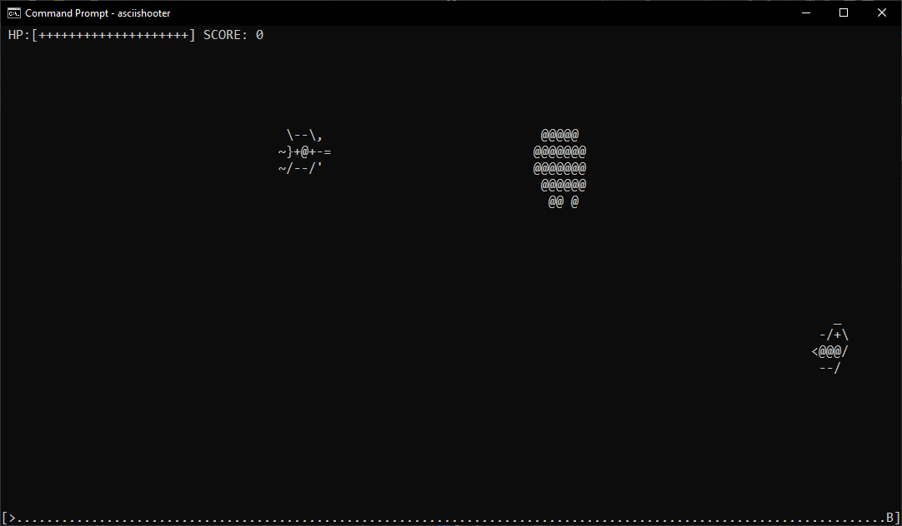

# ASCII-Shooter
A small but fun space shooter game that fully runs in the windows console and uses ASCII art as graphics. Developed using C++ and the Windows API to draw to the console.
# Usage
To run either double click the executable or (the fun way) add the directory containing the executable to the system path and use the command 'asciishooter'.
# Picture

